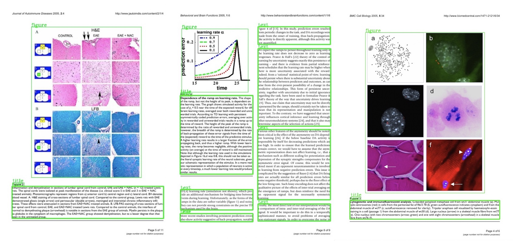
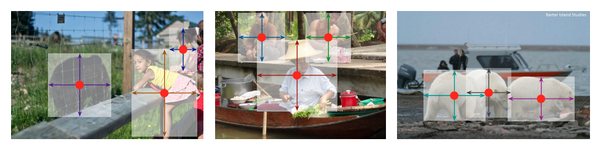

### 介绍
大家好，由于很多人反馈这本书，版式分析这一章节，没有实践，所以这里补充了一章内容主要是讲版面分割的。大概可以把文档的版式划分成几种类型的部分，主要有图像，文字内容等，如下图所示。

### 效果展示
<div align="center">
  
</div>


### 环境
```
Linux (Windows 暂未获得官方支持)
Python 3.7
PyTorch 1.6 或更高版本
torchvision 0.7.0
CUDA 10.1
NCCL 2
GCC 5.4.0 或更高版本
```

### 下载代码

给大家准备了一个小的基础框架。

```bash
git clone git@github.com:ocrbook/ToyOCR.git
```

安装依赖：

```bash
pip install -r requirements.txt
```

### 准备数据

数据我们已经为大家转好格式，下载下来之后，解压放到`datasets`目录即可。
数据下载: [百度云盘](https://pan.baidu.com/s/1Yjqkv_wGvNK5UuBVKcSQeQ )   提取码: cavs 


### 模型
我们使用一阶段模型centernet作为检测器，主要是该模型速度快，精度合适。
centernet的大致原理如下图所示
<div align="center">
  
</div>

centernet的原理是回归中心点以及高宽来达到定位的目标。它的原名是Objects as Points,大家别搞错了。链接为：[链接](https://arxiv.org/pdf/1904.07850.pdf)


### 教程


#### 数据部分

数据已经转为COCO检测格式，这里大家可以下载了直接用，转化为COCO格式，主要是COCO格式是标准的检测格式，也比较方便进行扩展。

#### 网络主体结构

backbone部分:
```python
class ResNet(nn.Module):

    def __init__(self, cfg, block, layers):
        self.inplanes = 64

        super(ResNet, self).__init__()
        self.conv1 = nn.Conv2d(3, 64, kernel_size=7, stride=2, padding=3,
                               bias=False)
        self.bn1 = get_norm(cfg, 64, momentum=BN_MOMENTUM)
        self.relu = nn.ReLU(inplace=True)
        self.maxpool = nn.MaxPool2d(kernel_size=3, stride=2, padding=1)
        self.layer1 = self._make_layer(cfg, block, 64, layers[0])
        self.layer2 = self._make_layer(cfg, block, 128, layers[1], stride=2)
        self.layer3 = self._make_layer(cfg, block, 256, layers[2], stride=2)
        self.layer4 = self._make_layer(cfg, block, 512, layers[3], stride=2)

    def _make_layer(self, cfg, block, planes, blocks, stride=1):
        downsample = None
        if stride != 1 or self.inplanes != planes * block.expansion:
            downsample = nn.Sequential(
                nn.Conv2d(self.inplanes, planes * block.expansion,
                          kernel_size=1, stride=stride, bias=False),
                get_norm(cfg, planes * block.expansion, momentum=BN_MOMENTUM),
            )

        layers = []
        layers.append(block(cfg, self.inplanes, planes, stride, downsample))
        self.inplanes = planes * block.expansion
        for i in range(1, blocks):
            layers.append(block(cfg, self.inplanes, planes))

        return nn.Sequential(*layers)

    def forward(self, x):
        x = self.conv1(x)
        x = self.bn1(x)
        x = self.relu(x)
        x = self.maxpool(x)

        # x = self.layer1(x)
        # x = self.layer2(x)
        # x = self.layer3(x)
        # x = self.layer4(x)
        x2 = self.layer1(x)
        x3 = self.layer2(x2)
        x4 = self.layer3(x3)
        x5 = self.layer4(x4)

        return x2, x3, x4, x5

    def init_weights(self, num_layers, pretrain):
        if pretrain:
            url = model_urls['resnet{}'.format(num_layers)]
            pretrained_state_dict = model_zoo.load_url(url)
            logger.info(f"initial from {url}")
            incompatible = self.load_state_dict(pretrained_state_dict, strict=False)
            if incompatible.missing_keys:
                logger.info(
                    get_missing_parameters_message(incompatible.missing_keys)
                )
            if incompatible.unexpected_keys:
                logger.info(
                    get_unexpected_parameters_message(incompatible.unexpected_keys)
                )


resnet_spec = {18: (BasicBlock, [2, 2, 2, 2]),
               34: (BasicBlock, [3, 4, 6, 3]),
               50: (Bottleneck, [3, 4, 6, 3]),
               101: (Bottleneck, [3, 4, 23, 3]),
               152: (Bottleneck, [3, 8, 36, 3])}


```


neck部分主要是fpn结构：
```python
class FPNDeconv(nn.Module):
    """
    The head used in CenterNet for object classification and box regression.
    It has three subnet, with a common structure but separate parameters.
    """
    def __init__(self, cfg):
        super(FPNDeconv, self).__init__()
        # modify into config
        channels = cfg.MODEL.DETNET.DECONV_CHANNEL
        deconv_kernel = cfg.MODEL.DETNET.DECONV_KERNEL
        modulate_deform = cfg.MODEL.DETNET.MODULATE_DEFORM
        use_deform = cfg.MODEL.DETNET.USE_DEFORM
        bias = False
        inner_channel = cfg.MODEL.DETNET.INNER_CHANNEL

        self.in5 = nn.Conv2d(channels[0], inner_channel, 1, bias=bias)
        self.in4 = nn.Conv2d(channels[1], inner_channel, 1, bias=bias)
        self.in3 = nn.Conv2d(channels[2], inner_channel, 1, bias=bias)
        self.in2 = nn.Conv2d(channels[3], inner_channel, 1, bias=bias)

        self.deconv1 = DeconvLayer(
            cfg,
            inner_channel,
            inner_channel,
            deconv_kernel=deconv_kernel[0],
            modulate_deform=modulate_deform,
            use_deform=use_deform,
        )
        self.deconv2 = DeconvLayer(
            cfg,
            inner_channel,
            inner_channel,
            deconv_kernel=deconv_kernel[1],
            modulate_deform=modulate_deform,
            use_deform=use_deform,
        )
        self.deconv3 = DeconvLayer(
            cfg,
            inner_channel,
            inner_channel,
            deconv_kernel=deconv_kernel[2],
            modulate_deform=modulate_deform,
            use_deform=use_deform,
        )

        self.out5 = nn.Sequential(
            nn.Conv2d(inner_channel,
                      inner_channel // 4,
                      3,
                      padding=1,
                      bias=bias), nn.Upsample(scale_factor=8, mode='nearest'))
        self.out4 = nn.Sequential(
            nn.Conv2d(inner_channel,
                      inner_channel // 4,
                      3,
                      padding=1,
                      bias=bias), nn.Upsample(scale_factor=4, mode='nearest'))
        self.out3 = nn.Sequential(
            nn.Conv2d(inner_channel,
                      inner_channel // 4,
                      3,
                      padding=1,
                      bias=bias), nn.Upsample(scale_factor=2, mode='nearest'))
        self.out2 = nn.Conv2d(inner_channel,
                              inner_channel // 4,
                              3,
                              padding=1,
                              bias=bias)
        
        self.in5.apply(self.weights_init)
        self.in4.apply(self.weights_init)
        self.in3.apply(self.weights_init)
        self.in2.apply(self.weights_init)
        self.out5.apply(self.weights_init)
        self.out4.apply(self.weights_init)
        self.out3.apply(self.weights_init)
        self.out2.apply(self.weights_init)

    def weights_init(self, m):
        classname = m.__class__.__name__
        if classname.find('Conv') != -1:
            nn.init.kaiming_normal_(m.weight.data)
        elif classname.find('BatchNorm') != -1:
            m.weight.data.fill_(1.)
            m.bias.data.fill_(1e-4)

    def forward(self, x):

        c2, c3, c4, c5 = x
        in5 = self.in5(c5)
        in4 = self.in4(c4)
        in3 = self.in3(c3)
        in2 = self.in2(c2)
        
        out4 = self.deconv1(in5) + in4  # 1/16
        out3 = self.deconv2(out4) + in3  # 1/8
        out2 = self.deconv3(out3) + in2  # 1/4

        p5 = self.out5(in5)
        p4 = self.out4(out4)
        p3 = self.out3(out3)
        p2 = self.out2(out2)

        fuse = torch.cat((p5, p4, p3, p2), 1)
        return fuse

```

head部分：
```python
import cv2
import numpy as np
import torch
import torch.nn.functional as F
import torch.nn as nn

from data.transforms import CenterAffine


class SingleHead(nn.Module):
    def __init__(self, in_channel, out_channel, bias_fill=False, bias_value=0):
        super(SingleHead, self).__init__()
        self.feat_conv = nn.Conv2d(
            in_channel, in_channel, kernel_size=3, padding=1)
        self.relu = nn.ReLU()
        self.out_conv = nn.Conv2d(in_channel, out_channel, kernel_size=1)
        if bias_fill:
            self.out_conv.bias.data.fill_(bias_value)

    def forward(self, x):
        x = self.feat_conv(x)
        x = self.relu(x)
        x = self.out_conv(x)
        return x


class CenternetHead(nn.Module):
    """
    The head used in CenterNet for object classification and box regression.
    It has three subnet, with a common structure but separate parameters.
    """

    def __init__(self, cfg):
        super(CenternetHead, self).__init__()
        self.cls_head = SingleHead(
            64,
            cfg.MODEL.DETNET.NUM_CLASSES,
            bias_fill=True,
            bias_value=cfg.MODEL.DETNET.BIAS_VALUE,
        )
        self.wh_head = SingleHead(64, 2)
        self.reg_head = SingleHead(64, 2)

    def forward(self, x):
        cls = self.cls_head(x)
        cls = torch.sigmoid(cls)
        wh = self.wh_head(x)
        reg = self.reg_head(x)
        pred = {"cls": cls, "wh": wh, "reg": reg}
        return pred

```

head部分主要是几层feature map,cls类别,wh是宽高。根据这些feature map最终还原成相关的框。
最终还原的部分，在`modeling/decoders/centernet_decode.py`模块，主要是使用topk找到正中心，然后结合宽高，还原回相应的bounding box以及得分和类别。


### 执行训练
配置主要在`yamls/text_detection/toydet_text.yaml`
读者需要根据自己显卡大小进行相应的配置。

```yaml
MODEL:
  #WEIGHTS: "detectron2://ImageNetPretrained/MSRA/R-50.pkl"
  WEIGHTS: '' #'exp_results/layout_exp_R50_SGD/model_final.pth'

  META_ARCHITECTURE: "CenterNet"
  BN_TYPE: "BN"
  BACKBONE:
    NAME: "build_resnet"
    DEPTH: 50
    PRETRAIN: True
  PIXEL_MEAN: [0.485, 0.456, 0.406]
  PIXEL_STD: [0.229, 0.224, 0.225]

  DETNET:
    DECONV_CHANNEL: [2048, 256, 128, 64]
    DECONV_KERNEL: [4, 4, 4]
    NUM_CLASSES: 5
    MODULATE_DEFORM: True
    BIAS_VALUE: -2.19
    DOWN_SCALE: 4
    MIN_OVERLAP: 0.3
    TENSOR_DIM: 128

TEST:
  EVAL_PERIOD: 100 
DATALOADER:
  NUM_WORKERS: 20 

DATASETS:
  TRAIN: ("layout_train",)
  TEST: ("layout_val",)

SOLVER:
  IMS_PER_BATCH: 2 #可以根据你的显存大小尽量多塞一些图片
  WARMUP_ITERS: 1
  STEPS: (20, 30)
  MAX_ITER: 40
  BASE_LR: 0.005 #5e-4
  LR_SCHEDULER_NAME: "WarmupCosineAnnealingLR"
  COSINE_DECAY_ITER: 0.6
  OPTIM_NAME: "SGD"
  CLIP_GRADIENTS:
    ENABLED: True
    CLIP_TYPE: "value"
    CLIP_VALUE: 1.0

INPUT:
  FORMAT: 'RGB'
  MIN_SIZE_TEST: 0
  MIN_SIZE_TRAIN: (384, 448, 512,)
  MAX_SIZE_TRAIN: 512   #也可以调节训练图片大小
  CROP:
    ENABLED: True
    TYPE: "relative_range"
    SIZE: [0.6, 0.6]

OUTPUT_DIR: "exp_results/layout_exp_R50"   #输出日志以及模型
VERSION: 2

```

训练执行：

```bash
CUDA_VISIBLE_DEVICES=0 python train_net.py \
  --config-file yamls/text_detection/toydet_text.yaml  \
  --num-gpus 1 \
  --dist-url "tcp://127.0.0.1:50001" \
```


测试看效果：

```bash
CUDA_VISIBLE_DEVICES=0 python inference/demo.py
```


